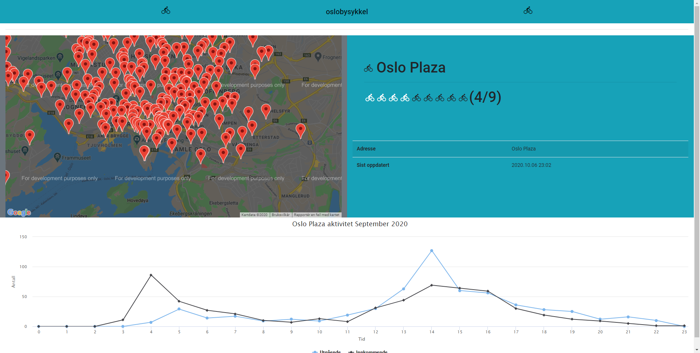
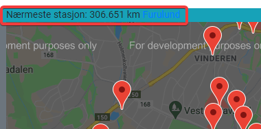

# OsloBysykkel
## Introduction
This angular application displays live data from oslobysykkel (https://oslobysykkel.no/apne-data/sanntid).
Combining Google maps js API and the end-users current position it automatically find the closest station that has availabe bikes.
Highchart displays the stations historical data for september 2020 to give an impression when the station is most busy. Due to large data set I limited this to only September 2020, so these estimations might not be as accurate in other seasons of the year.

Known issue when using VPN. Upon switching it will take some time to get the geolocation from the browser.
